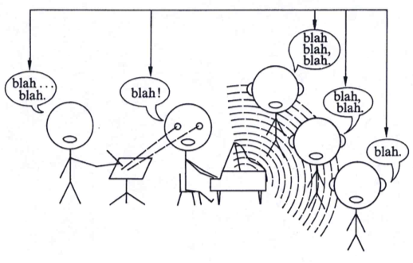

.. WesterParse documentation master file, created by
   sphinx-quickstart on Wed Jul  1 12:38:32 2020.

.. instructions: https://www.sphinx-doc.org/en/master/index.html
.. commands to build html and pdf/latex files
   sphinx-build -b html . _build
   make latexpdf

The WesterParse Project
=======================

This project implements the theory of tonal music presented in chapters 4-6 of 
*An Introduction to Tonal Theory* (New York: Norton, 1975) by Peter Westergaard.

There are two main components: a *parser* that evaluates the structure of 
musical lines used in species species counterpoint, and a *checker* that evaluates the
voice leading of species counterpoint compositions. 

Westergaard's innovative contribution to the pedagogical discipline of species 
counterpoint was the formulation of a syntax for contrapuntal lines and an explication 
of the cognitive issues involved in how listeners parse the syntax of such lines. 
Hence the name of this program, **WesterParse**.

   
   Blah, blah, blah: developing a shared metalanguage for the musical object language (Westergaard 1975, 9)
   
   ..

.. toctree::
   :maxdepth: 2
   :caption: Contents:

   usage/README
   usage/userguide
   usage/speciesrules
   usage/speciesguide
   usage/corpus
   usage/modulesdoc
   usage/license
   
   

Indices and tables
==================

* :ref:`genindex`
* :ref:`modindex`
* :ref:`search`

