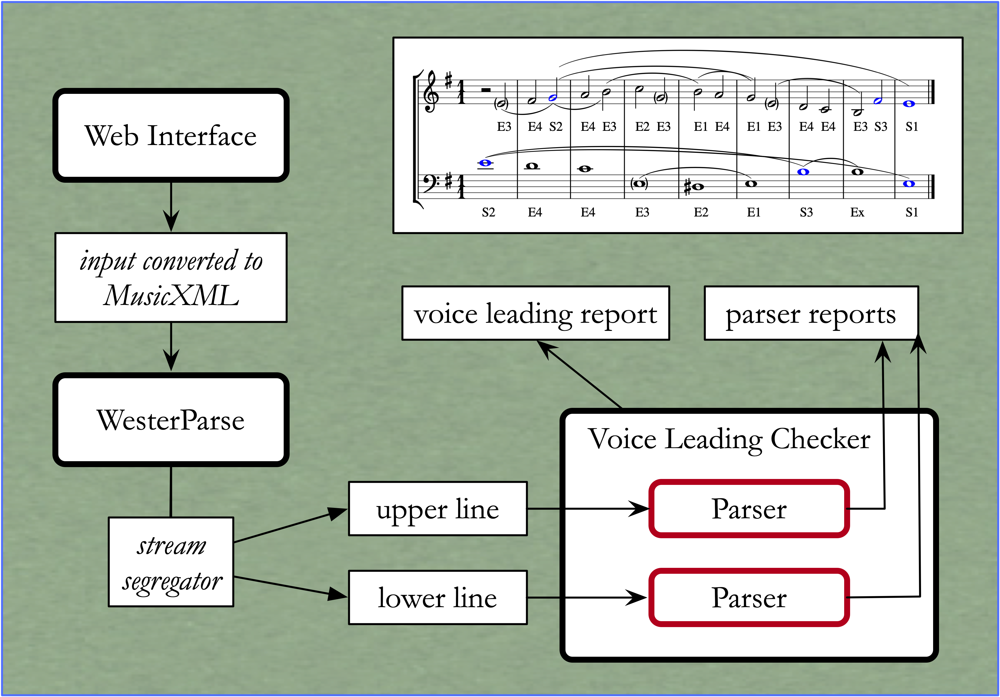

WesterParse Web Site
====================

  
   How WesterParse works behind the scenes on the web site.
  
   ..

Westegaardian Species Counterpoint Online
-----------------------------------------

https://ada.artsci.wustl.edu/westerparse/

The web interface was created by Stephen Pentecost, Senior Digital 
Humanities Specialist at Washington University in St. Louis.  

The user can create compositions of one, two, or three lines.  After completing a
composition, the user can have each line evaluated by WesterParse.  The result
is displayed beneath the music.  For example:

.. code-block:: shell

   PARSE REPORT
   Key inferred by program: C major
   The line is generable as a primary line but not as a bass line.
   
If WesterParse was unable to infer a single key for the composition, perhaps
because the line is not unambiguously in a single key,
the user has the option of selecting a key, thereby forcing WesterParse
to use that selection. 

The final line of the report states whether the line is generable as a
monotriadic line. If it is, WesterParse reports the types of line that are valid
interpretations. In the example above, the line could be interpreted as a
primary line (and, by implication, also as a generic line), but not as a bass
line. If the line was not generable in any fashion, WesterParse would identify
errors of composition, if possible. For example:

.. code-block:: shell

   Line Parsing Errors
  	The following linear errors were found when attempting
  	to interpret the line:
			
			   The non-tonic-triad pitch D4 in measure 4 cannot be generated.

If the user has composed counterpoint in two or three parts, the user can
have WesterParse check the voice leading. This, too, will generate a report.
Ideally, the user wants to see the following report:

.. code-block:: shell

   No voice-leading errors found.
   
In less than ideal circumstances, the user may encounter a report such as this:

.. code-block:: shell

   Voice Leading Report 

 	 The following voice-leading errors were found:
		
		    Forbidden parallel motion to octave going into bar 2.
	    	Forbidden parallel motion to fifth going into bar 4.
		    Prohibited leap of a fourth in bars 2 to 3.

